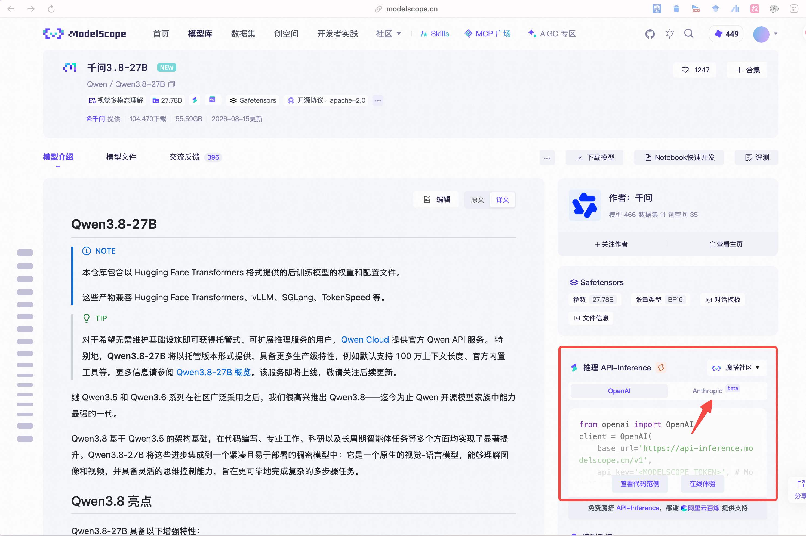
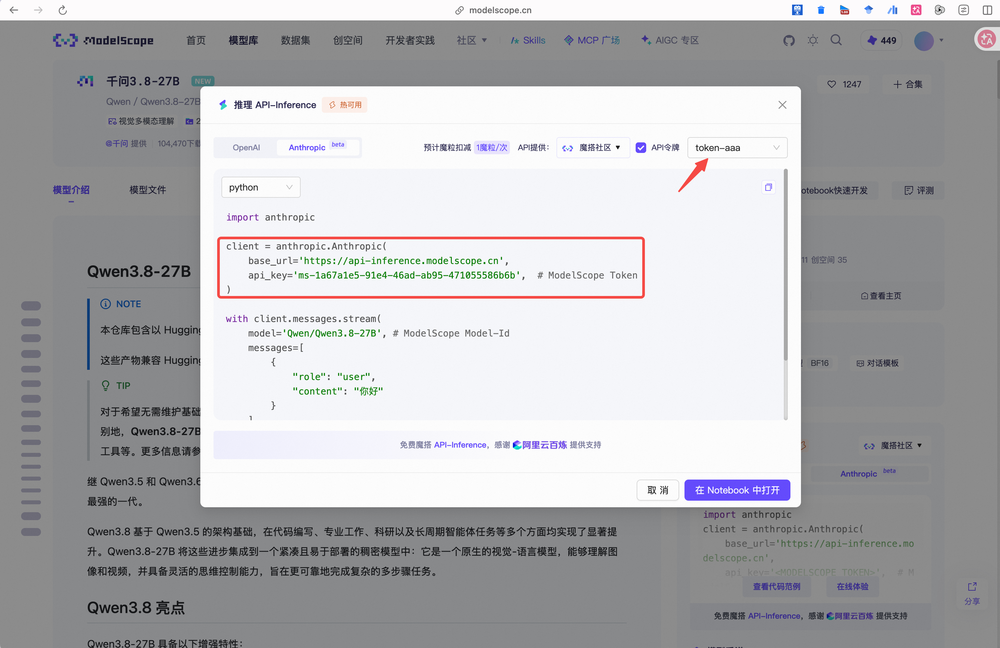

1. 注册 modelscope 
2. modelscope 免费模型使用说明：https://www.modelscope.cn/learn/1409
3. modelscope 免费模型列表：https://modelscope.cn/models?filter=inference_type&page=2&tabKey=task
4. 进入特定模型主页，比如 Qwen/Qwen3.8-27B：https://modelscope.cn/models/Qwen/Qwen3.8-27B

5. 查看 Anthropic api 协议的代码示例

6. 创建新的 api 令牌后，可以得到 base_url 和 api_key
7. 启动 claude：
```bash
export ANTHROPIC_MODEL=Qwen/Qwen3.8-27B  # 刚刚选的模型名
export ANTHROPIC_BASE_URL=https://api-inference.modelscope.cn  # base_url
export ANTHROPIC_AUTH_TOKEN=ms-1a67a1e5-91e4-46ad-ab95-471055586b6b  # api_key
claude
```
8. 开始学习并使用 claude
9. 快速上手：planning prompt (prompts/plan.txt) → implementation prompt (prompts/build-dashboard.txt)